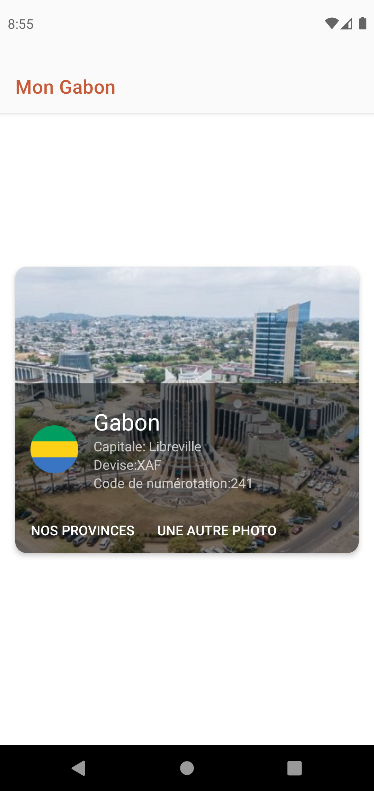
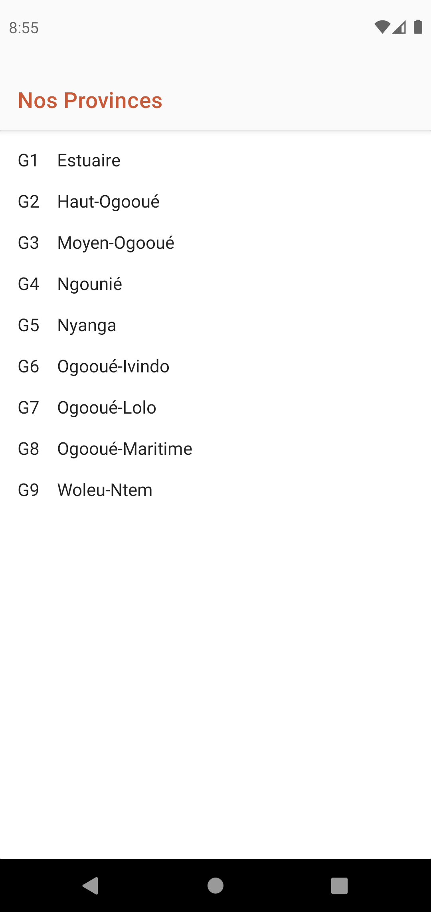

<h1 align="center">MyGabon</h1>

<p align="center">
   <a href="https://opensource.org/licenses/Mit"></a>
   <a href="https://android-arsenal.com/api?level=23"></a>
</p>

<p align="center">  
MyGabon is a small demo application based on modern Android application tech-stacks with Hilt and MVVM architecture.<br>This project focuses in Dependency injection, that is a technique widely used in programming and well suited to Android development. By following the principles of dependency injection, you lay the groundwork for a good app architecture.<br>
Also fetching data from the network with an API via repository pattern.
</p>
</br>

## Screenshoots

&emsp;
&emsp;</br>

## Tech stack & Open-source libraries
- Minimum SDK level 23
- [Kotlin](https://kotlinlang.org/) based + [Coroutines](https://github.com/Kotlin/kotlinx.coroutines) .
- [Hilt](https://dagger.dev/hilt/) - For dependency injection.
- JetPack
    - Lifecycle - dispose observing data when lifecycle state changes.
    - ViewModel - UI related data holder, lifecycle aware.
    - [LiveData](https://developer.android.com/topic/libraries/architecture/livedata) -  is an observable data holder class
    - [Navigation Component](https://developer.android.com/guide/navigation) - Navigation support for Jetpack Compose.
- Architecture
    - MVVM Architecture (Declarative View - ViewModel - Model)
    - Repository pattern
- [Moshi](https://github.com/square/moshi/) - A JSON library for Kotlin.
- [Coil](https://coil-kt.github.io/coil/) - An image loading library for Android backed by Kotlin Coroutines.
- [Retrofit2 & OkHttp3](https://github.com/square/retrofit) - construct the REST APIs and paging network data.
- Material Design & Animations
- [Timber](https://github.com/JakeWharton/timber) - logging.

## Find this repository useful? :heart:
Support it by joining __[stargazers](https://github.com/bangaromaric/repos-talk/stargazers)__ for this repository. :star: 🤩 <br>

## countriesnowAPI

MyGabon using the [PokeAPI](https://countriesnow.space/) for constructing RESTful API.<br>
countriesnowAPI provides a RESTful API with lots of Countries.


# License
```
Designed and developed by 2021 Romaric BANGA

Licensed under the Apache License, Version 2.0 (the "License");
you may not use this file except in compliance with the License.
You may obtain a copy of the License at

http://www.apache.org/licenses/LICENSE-2.0

Unless required by applicable law or agreed to in writing, software
distributed under the License is distributed on an "AS IS" BASIS,
WITHOUT WARRANTIES OR CONDITIONS OF ANY KIND, either express or implied.
See the License for the specific language governing permissions and
limitations under the License.
```

